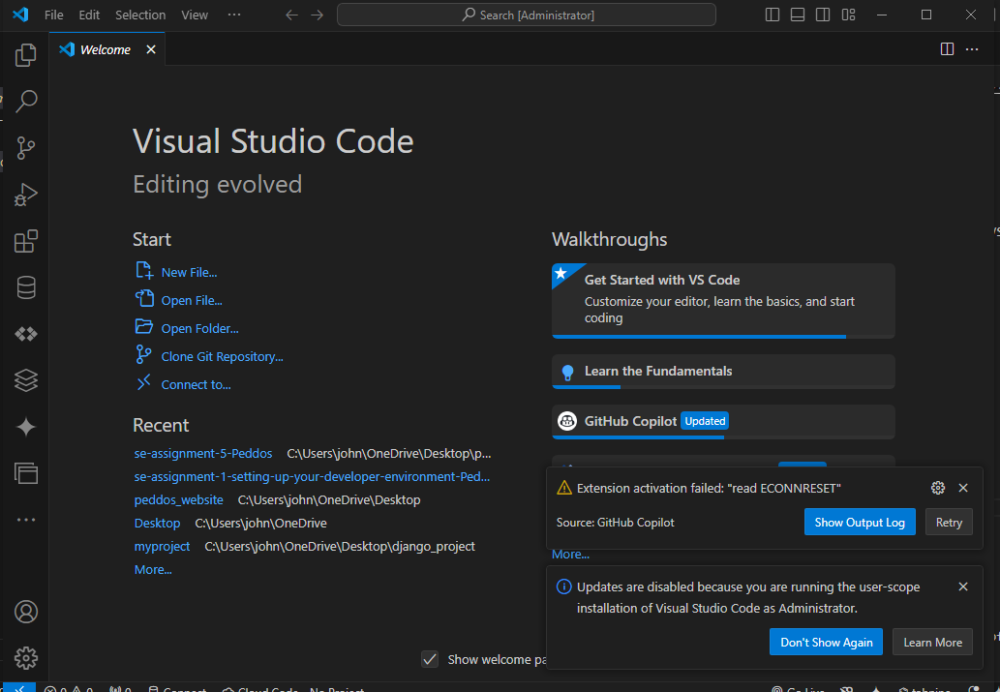
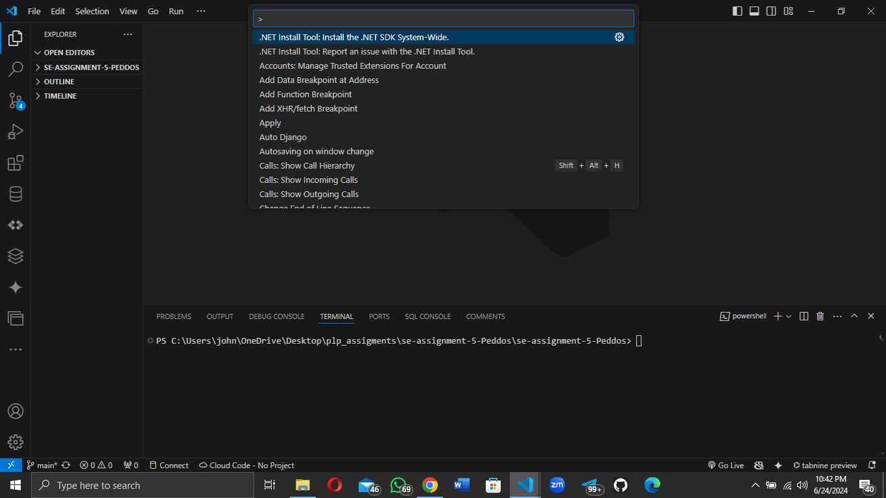
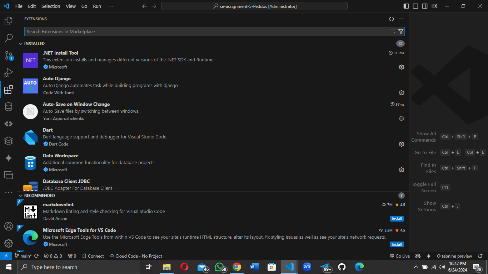
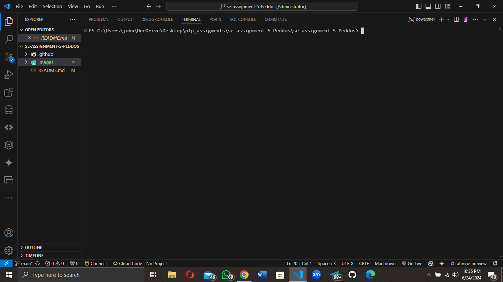
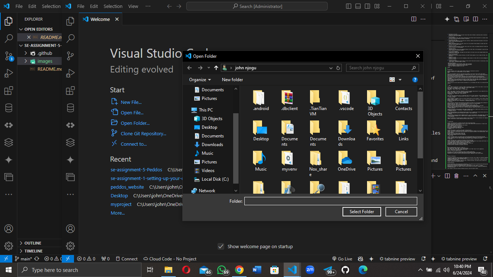
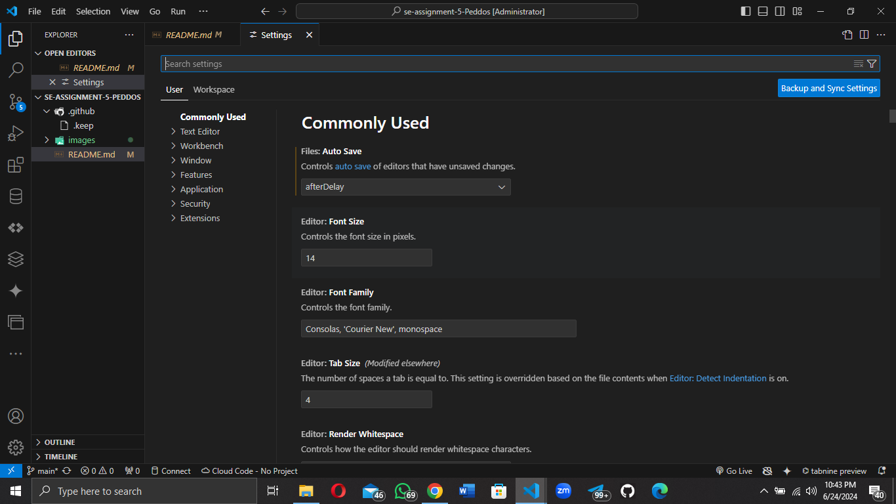
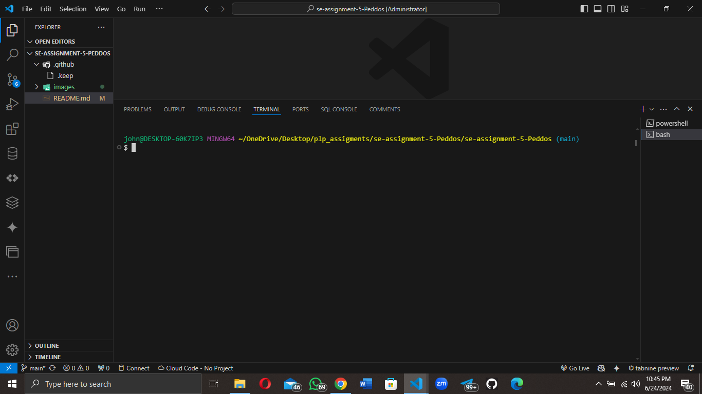

# SE-Assignment-5
Installation and Navigation of Visual Studio Code (VS Code)
 Instructions:
Answer the following questions based on your understanding of the installation and navigation of Visual Studio Code (VS Code). Provide detailed explanations and examples where appropriate.

 Questions:

1. Installation of VS Code:
   - Describe the steps to download and install Visual Studio Code on Windows 11 operating system. Include any prerequisites that might be needed.

2. First-time Setup:
   - After installing VS Code, what initial configurations and settings should be adjusted for an optimal coding environment? Mention any important settings or extensions.

3. User Interface Overview:
   - Explain the main components of the VS Code user interface. Identify and describe the purpose of the Activity Bar, Side Bar, Editor Group, and Status Bar.

4. Command Palette:
   - What is the Command Palette in VS Code, and how can it be accessed? Provide examples of common tasks that can be performed using the Command Palette.

5. Extensions in VS Code:
   - Discuss the role of extensions in VS Code. How can users find, install, and manage extensions? Provide examples of essential extensions for web development.

6. Integrated Terminal:
   - Describe how to open and use the integrated terminal in VS Code. What are the advantages of using the integrated terminal compared to an external terminal?

7. File and Folder Management:
   - Explain how to create, open, and manage files and folders in VS Code. How can users navigate between different files and directories efficiently?

8. Settings and Preferences:
   - Where can users find and customize settings in VS Code? Provide examples of how to change the theme, font size, and keybindings.

9. Debugging in VS Code:
   - Outline the steps to set up and start debugging a simple program in VS Code. What are some key debugging features available in VS Code?

10. Using Source Control:
    - How can users integrate Git with VS Code for version control? Describe the process of initializing a repository, making commits, and pushing changes to GitHub.

 Submission Guidelines:
- Your answers should be well-structured, concise, and to the point.
- Provide screenshots or step-by-step instructions where applicable.
- Cite any references or sources you use in your answers.
- Submit your completed assignment by 1st July 

answers

1.

Prerequisites:

Internet Connection: You'll need a stable internet connection to download the installer.
Windows 11: Ensure you're running Windows 11 on your computer.
Steps:

Visit the VS Code Website: Open your web browser and navigate to the official Visual Studio Code website.
Download the Installer: Locate the "Download for Windows" button and click it. This will initiate the download of the VS Code installer file (usually an .exe file).
Run the Installer: Once the download is complete, locate the downloaded installer file and double-click it to run it.
Follow the Installation Wizard: The VS Code installer will guide you through the installation process.
Select Installation Location: Choose the directory where you want to install VS Code. The default location is usually recommended.
Select Additional Tasks: You might be given options to add VS Code to your Start menu, create a desktop shortcut, or register VS Code as the default editor for certain file types. Choose the options that suit your preferences.
Complete the Installation: Click "Finish" to complete the installation process.
Post-Installation:

Launch VS Code: You can now launch VS Code by searching for it in the Windows Start menu or by clicking the desktop shortcut.

2.
1. Theme:

Choose a Theme: VS Code offers a variety of themes to personalize the look and feel of your editor. You can find themes in the "File" > "Preferences" > "Color Theme" menu. Popular themes include:
Dark Themes: "Dark+ (Default Dark)" or "Dracula"
Light Themes: "Light+ (Default Light)" or "GitHub Light"
2. Font:

Select a Font: Choose a font that's comfortable to read for extended coding sessions. You can change the font in the "File" > "Preferences" > "Font" menu. Popular coding fonts include:
Monospace Fonts: "Consolas", "Fira Code", "JetBrains Mono"
Proportional Fonts: "Roboto Mono", "Source Code Pro"
3. Font Size:

Adjust Font Size: Set the font size to a comfortable level for your screen resolution. You can change the font size in the "File" > "Preferences" > "Font Size" menu or use the Ctrl + + (Zoom In) and Ctrl + - (Zoom Out) keyboard shortcuts.
4. Workspace Settings:

Create a Workspace: A workspace allows you to group related projects and files together. You can create a workspace by opening a folder in VS Code.
Workspace Settings: Within a workspace, you can customize settings specific to that project. You can access workspace settings by clicking the "File" > "Preferences" > "Workspace Settings" menu.
5. Extensions:

Install Extensions: Extensions add functionality and features to VS Code. You can find and install extensions from the Extensions view (Ctrl + Shift + X). Here are some essential extensions for web development:
Prettier: Formats your code to ensure consistent style.
Bracket Pair Colorizer: Helps you visually identify matching brackets in your code.
Live Server: Starts a local web server to preview your HTML, CSS, and JavaScript files in real-time.
ESLint: A linter that helps you identify and fix potential errors in your JavaScript code.
GitHub Pull Requests and Issues: Allows you to review and manage pull requests and issues directly within VS Code.
6. Keyboard Shortcuts:

Customize Keybindings: VS Code provides a wide range of keyboard shortcuts to speed up your workflow. You can customize keybindings in the "File" > "Preferences" > "Keyboard Shortcuts" menu.
7. Integrated Terminal:

Enable Integrated Terminal: The integrated terminal allows you to run commands and scripts directly within VS Code. You can open the integrated terminal by clicking the "Terminal" > "New Terminal" menu.
8. Debugging:

Enable Debugging: VS Code has powerful debugging features. You can set breakpoints, step through code, and inspect variables. To enable debugging, you'll need to install a debugger extension for your programming language.
9. Git Integration:

Enable Git Integration: VS Code has built-in support for Git version control. You can initialize a Git repository, commit changes, and push code to remote repositories directly within VS Code.

3.
1. Activity Bar:

Location: The Activity Bar is located on the left side of the VS Code window.
Purpose: The Activity Bar provides quick access to core VS Code features and functionalities. It houses icons representing different views, such as:
Explorer: Manages files and folders within your project.
Search: Finds text within your project.
Source Control: Manages Git repositories.
Run and Debug: Executes and debugs your code.
Extensions: Manages VS Code extensions.
2. Side Bar:

Location: The Side Bar is located to the right of the Activity Bar.
Purpose: The Side Bar provides context-specific information and actions related to the currently active view. For example, when you're in the Explorer view, the Side Bar will display the contents of the selected folder. The Side Bar can also display:
Outline: Shows the structure of the current file.
Problems: Lists errors and warnings in your code.
Debug: Provides debugging controls and information.
3. Editor Group:

Location: The Editor Group is the central area of the VS Code window where you write and edit your code.
Purpose: The Editor Group can display multiple files simultaneously, allowing you to work on different parts of your project side-by-side. You can create and manage multiple Editor Groups to organize your workflow.
4. Status Bar:

Location: The Status Bar is located at the bottom of the VS Code window.
Purpose: The Status Bar provides essential information about the current state of your project and VS Code. It displays:
Line and Column Number: Indicates the current cursor position in the file.
File Encoding: Shows the character encoding of the current file.
Language Mode: Identifies the programming language of the current file.
Git Status: Displays the status of your Git repository.
Warnings and Errors: Indicates any problems in your code.

4.

Open the Command Palette: Press Ctrl + Shift + P.
Type "theme": Start typing "theme" in the Command Palette.
Select "Preferences: Color Theme": Choose the "Preferences: Color Theme" option from the suggestions.
Choose a Theme: Select the desired theme from the list.
Benefits of Using the Command Palette:

Efficiency: It saves time by eliminating the need to navigate through menus.
Discoverability: It helps you discover hidden features and commands you might not know about.
Flexibility: It allows you to perform tasks quickly and easily, regardless of your current context.

5.

The Role of Extensions:

Functionality: Extensions add new features and capabilities to VS Code, such as support for different programming languages, debugging tools, code formatting, and more.
Customization: They allow users to personalize their coding environment by adding themes, changing keybindings, and integrating with external tools.
Efficiency: Extensions can automate repetitive tasks, streamline workflows, and improve overall productivity.
Finding, Installing, and Managing Extensions:

Finding Extensions:

Extension Marketplace: The VS Code Extension Marketplace is the central hub for discovering and installing extensions. You can access it through the Extensions view (Ctrl + Shift + X).
Search: Use the search bar in the Extensions view to find extensions by name, keyword, or category.
Recommendations: VS Code often suggests relevant extensions based on your project's language and dependencies.
Installing Extensions:

Click "Install": Once you've found an extension you want, click the "Install" button.
VS Code Restart: VS Code may prompt you to restart to apply the extension.
Managing Extensions:

Extensions View: The Extensions view (Ctrl + Shift + X) allows you to manage your installed extensions.
Enable/Disable: You can enable or disable extensions as needed.
Uninstall: You can uninstall extensions you no longer use.
Update: VS Code automatically checks for updates to your extensions.
Essential Extensions for Web Development:

Prettier: Formats your code to ensure consistent style and readability.
Bracket Pair Colorizer: Helps you visually identify matching brackets in your code, making it easier to navigate complex code structures.
Live Server: Starts a local web server to preview your HTML, CSS, and JavaScript files in real-time, allowing you to see changes instantly.
ESLint: A linter that helps you identify and fix potential errors in your JavaScript code, improving code quality and catching bugs early.
GitHub Pull Requests and Issues: Allows you to review and manage pull requests and issues directly within VS Code, streamlining your workflow for collaborative development.
VSCode-icons: Provides a set of icons for different file types, making it easier to identify files in your project.
Path Intellisense: Provides intelligent path completion for file imports and references, saving you time and reducing errors.

6.

Opening the Integrated Terminal:

Menu: Go to Terminal > New Terminal.
Keyboard Shortcut: Press Ctrl + ` (backtick).
Using the Integrated Terminal:

Command Execution: You can type commands directly into the terminal and press Enter to execute them.
Shell Integration: The integrated terminal uses the same shell as your system's default terminal, allowing you to use the same commands and scripts.
Tab Completion: Press Tab to autocomplete commands and file paths.
History: Use the up and down arrow keys to navigate through your command history.
Multiple Terminals: You can open multiple terminals by clicking the "New Terminal" button in the terminal view.
Advantages of the Integrated Terminal:

Convenience: It's directly integrated into VS Code, eliminating the need to switch between windows or applications.
Context Awareness: The integrated terminal is aware of your current project and file, making it easier to run commands related to your work.
Code Execution: You can run your code directly from the terminal, making it easy to test and debug.
Output Integration: The terminal output is displayed within VS Code, making it easier to see the results of your commands.
Customization: You can customize the terminal's appearance, font, and behavior through VS Code settings.
Comparison to External Terminals:

While external terminals offer more advanced features and customization options, the integrated terminal provides a streamlined and convenient way to interact with your system and project directly within VS Code. It's a great option for everyday tasks and development workflows.

Example:

Let's say you want to run a Python script named "my_script.py" from your project directory. You can do this using the integrated terminal:

Open the Integrated Terminal: Press Ctrl + `.
Run the Script: Type python my_script.py and press Enter.

7.

1. Creating Files and Folders:

Explorer View: Open the Explorer view by clicking the "Explorer" icon in the Activity Bar (left side of the window).
Create a Folder: Right-click within the Explorer view and select "New Folder". Give your folder a descriptive name.
Create a File: Right-click within the folder you want to create a file in and select "New File". Give your file a name with the appropriate extension (e.g., .txt, .js, .py).
2. Opening Files and Folders:

Explorer View: Navigate through your project's folders and files using the Explorer view.
Double-Click: Double-click on a file to open it in the Editor Group.
Open Folder: You can open an existing folder as a workspace by clicking "File" > "Open Folder" and selecting the desired folder.
3. Managing Files and Folders:

Rename: Right-click on a file or folder and select "Rename" to change its name.
Delete: Right-click on a file or folder and select "Delete" to remove it.
Copy/Paste: You can copy and paste files and folders within your project using the standard keyboard shortcuts (Ctrl + C, Ctrl + V).
Move: Drag and drop files and folders to move them within your project.
4. Efficient Navigation:

Explorer View: Use the Explorer view to quickly browse through your project's structure.
Search: Use the search bar in the Explorer view to find specific files or folders.
Go to Definition: If you're working with code, you can use the "Go to Definition" command (Ctrl + Click or F12) to jump to the definition of a function, variable, or class.
Keyboard Shortcuts: Use keyboard shortcuts like Ctrl + P (Quick Open) to quickly open files or Ctrl + Shift + P (Command Palette) to search for files and folders.
Breadcrumbs: The breadcrumbs at the top of the Editor Group show your current file's location within the project hierarchy, allowing you to easily navigate back to parent folders.
Example:

Let's say you're working on a web project and need to create a new JavaScript file within a "scripts" folder.

Open the Explorer View: Click the "Explorer" icon in the Activity Bar.
Create the "scripts" Folder: Right-click within the project folder and select "New Folder". Name it "scripts".
Create the JavaScript File: Right-click within the "scripts" folder and select "New File". Name it "main.js".

8.

9.
1. Install a Debugger Extension:

Language-Specific Debugger: VS Code has built-in support for debugging JavaScript, TypeScript, Python, and other popular languages. However, for other languages, you'll need to install a debugger extension from the VS Code Marketplace.
Example: For debugging Python code, you can install the "Python" extension.
2. Create a launch.json File:

Debug View: Open the Debug view by clicking the "Run and Debug" icon in the Activity Bar.
Create a Configuration: Click the "Create a launch.json file" button in the Debug view.
Select a Configuration: Choose the appropriate configuration for your language and debugging needs.
Customize the Configuration: Modify the launch.json file to specify the program you want to debug, the debugger type, and any other relevant settings.
3. Set Breakpoints:

Click in the Gutter: Click in the gray area to the left of the line numbers in your code editor to set a breakpoint. A red dot will appear, indicating the breakpoint.
Conditional Breakpoints: You can set breakpoints that only trigger under specific conditions, such as when a variable reaches a certain value.
4. Start Debugging:

Start Debugging: Click the green "Start Debugging" button in the Debug view.
Run to Breakpoint: VS Code will execute your program until it reaches a breakpoint.
Step Through Code: Use the following controls in the Debug view to step through your code:
Step Over: Executes the current line of code and moves to the next line.
Step Into: Steps into a function call.
Step Out: Executes the remaining code in the current function and returns to the caller.
Continue: Continues execution until the next breakpoint or the end of the program.
5. Inspect Variables and Call Stack:

Variables View: The Variables view in the Debug view shows the values of variables at the current breakpoint.
Call Stack View: The Call Stack view shows the sequence of function calls that led to the current breakpoint.
Key Debugging Features in VS Code:

Conditional Breakpoints: Trigger breakpoints based on specific conditions.
Watch Expressions: Monitor the values of expressions during debugging.
Log Points: Insert log statements into your code without modifying it.
Data Breakpoints: Pause execution when the value of a variable changes.
Exception Breakpoints: Break execution when an exception is thrown.
Multi-threaded Debugging: Debug programs with multiple threads.
Remote Debugging: Debug programs running on remote machines.
Example:

Let's say you want to debug a simple Python script named my_script.py.

Install the Python Extension: Install the "Python" extension from the VS Code Marketplace.
Create a launch.json File: Open the Debug view, click "Create a launch.json file", and select the "Python: Current File" configuration.
Set a Breakpoint: Click in the gutter next to the line of code you want to pause at.
Start Debugging: Click the green "Start Debugging" button.
Step Through Code: Use the step controls to navigate through your code and inspect variables.

10.

1. Initializing a Git Repository:

Open the Source Control View: Click the "Source Control" icon in the Activity Bar (left side of the window).
Initialize Repository: If your project doesn't have a Git repository yet, click the "Initialize Repository" button in the Source Control view.
Confirm Initialization: VS Code will create a .git folder in your project directory, indicating that it's now under Git version control.
2. Making Commits:

Stage Changes: In the Source Control view, you'll see a list of changes you've made to your files. Click the "+" icon next to a file to stage it for commit. This means you're adding it to the next commit.
Write a Commit Message: In the Source Control view, enter a clear and concise commit message describing the changes you've made.
Commit Changes: Click the "Commit" button to create a commit. This saves a snapshot of your project at this point in time.
3. Pushing Changes to GitHub:

Connect to GitHub: If you haven't already, connect your VS Code to your GitHub account by going to File > Preferences > Settings (or Code > Preferences > Settings on macOS) and searching for "GitHub".
Create a Remote Repository: Create a new repository on GitHub for your project.
Add a Remote: In the Source Control view, click the "…" button and select "Add Remote". Enter the URL of your GitHub repository.
Push Changes: Click the "Push" button in the Source Control view to upload your local commits to the remote GitHub repository.
Example:

Let's say you've made some changes to your project and want to commit them to a GitHub repository:

Stage Changes: In the Source Control view, select the files you want to commit by clicking the "+" icon next to them.
Write a Commit Message: Enter a message like "Added new feature" in the commit message box.
Commit Changes: Click the "Commit" button.
Push Changes: Click the "Push" button to upload your commit to GitHub.
Additional Git Features in VS Code:

Branching and Merging: VS Code provides tools for creating, switching between, and merging branches.
Pull Requests: You can create and review pull requests directly within VS Code.
History View: The Source Control view allows you to view the commit history of your project.
Stashing Changes: You can temporarily save your changes without committing them using the "Stash" feature.d